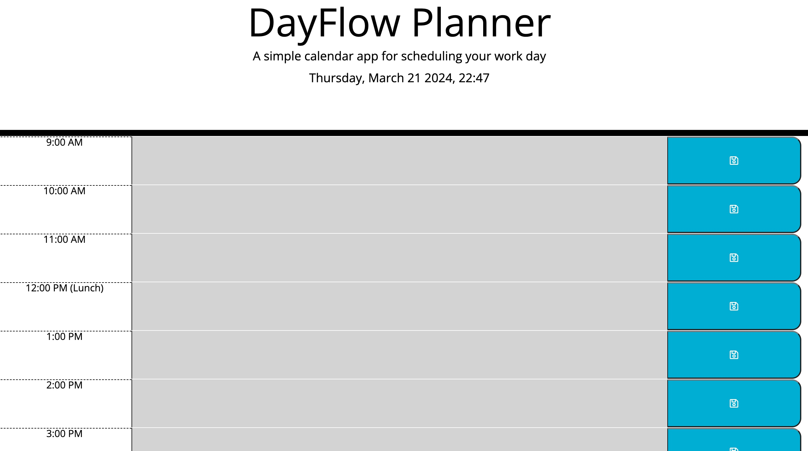

# DayFlow Planner
DayFlow is a minimalist web application designed to streamline your workday scheduling. With its intuitive interface and essential features, DayFlow empowers users to efficiently manage their daily tasks and appointments.

link: https://giftyaning.github.io/DayFlow/

FEATURES:

Prominently displays the current day at the top, ensuring users stay oriented with the date.

Provides hourly time blocks covering standard business hours (9:00 AM to 5:00 PM), offering users a structured layout to plan their day effectively.

Time blocks are color-coded to indicate past, present, and future hours. This visual cue helps users quickly identify the current time and upcoming events.

Users can click on any time block to enter and save an event or task for that hour. Events are saved locally, allowing users to persist their schedule between sessions.

Usage:

Upon opening DayFlow, users will see the current day displayed at the top of the page.

Scheduling Events: 

To schedule an event, simply click on the time block corresponding to the desired hour. A text area will appear, allowing you to enter the details of the event. Click the save button to store the event.

Saving Events: 

Events are saved locally in the browser's storage. This ensures that your schedule is retained even if you close the browser or refresh the page.

Technologies Used:

HTML5
CSS3
JavaScript 
Day.js 

Author:
DayFlow Planner was developed by Gifty Aning. Feel free to reach out with any feedback or suggestions for improvement.
